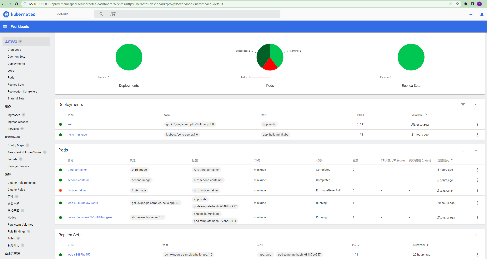
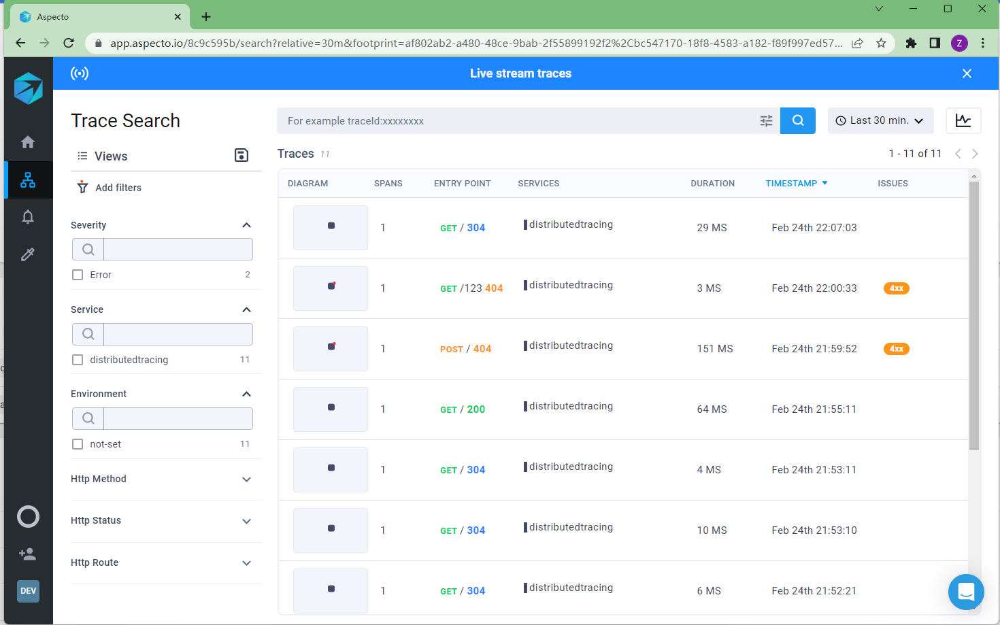
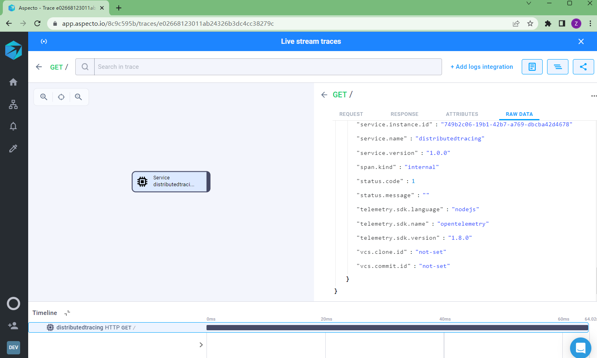
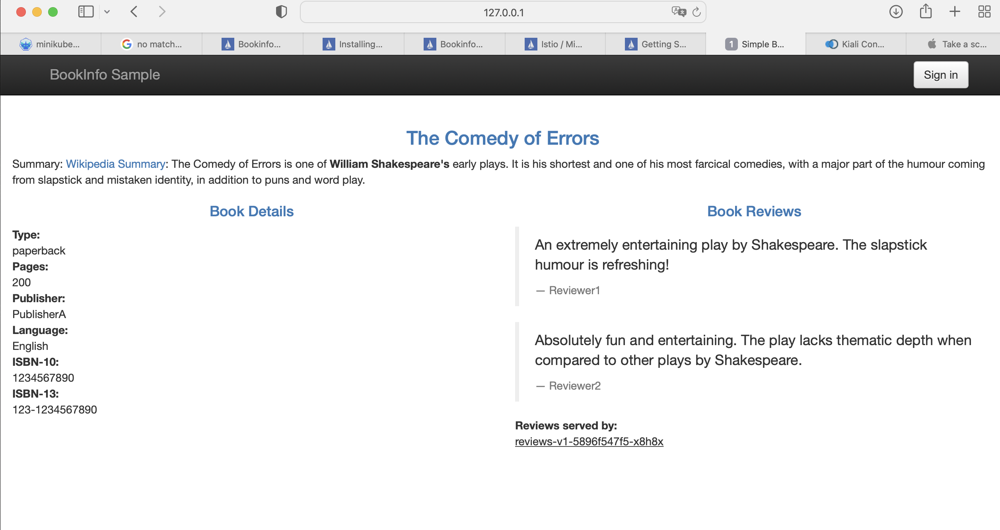
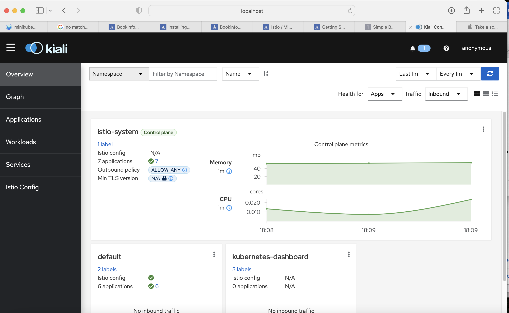
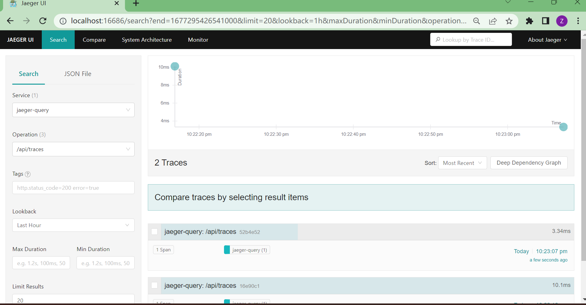

# distributed_tracing_2023sprint_bdml

> This is the directory for Big Data and ML class codes and configuration files.

## Table of Contents

- [What I did for the past few weeks](#what-i-did-for-the-past-few-weeks)
- [What I am currently working on](#what-i-am-currently-working-on)
- [What's my plan](#whats-my-plan)

- [File Directory](#file-directory)

## What I did for the past few weeks

In the past few weeks, I first learn about kubernetes and minikube, and set up deployment and pods with various tutorials. 

Besides, I use opentelemetry to get simple trace with [NodeJS](https://opentelemetry.io/docs/instrumentation/js/getting-started/nodejs/). After getting simple trace information from opentelemetry, I tried [Aspecto](https://www.aspecto.io/), a free distributed tracing tool. I was able to get live strean traces with this tool, and can see the detail of these traces.

After, I implement [multiple nodes](https://minikube.sigs.k8s.io/docs/tutorials/multi_node/) on minikube with kubernetes, and deploy with dockerfile. Related file is in dockerize_minikube. 

## What I am curretly working on

I am currently working on getting Istio trace out with minikube, and remodify it to get traces for my own app. I have successfully get Kiali dashboard out and see the graph between services

Apart from using Istio, I am also trying OpenTelemetry. People can use OpenTelemetry Collector to specify data output and can easily maintain open source observability data formats(e.g. Jeager, etc). I followed these two tutorials, try to implement distributed tracing with OpenTelemetry Collector:

https://www.aspecto.io/blog/distributed-tracing-with-opentelemetry-collector-on-kubernetes/
https://www.aspecto.io/blog/opentelemetry-collector-guide/#Configuring-Your-Collector-to-Send-Data-to-an-Observability-Vendor

With these two tutorials, I was able to set up jaeger and open webpage of jaeger. But something went wrong between jaeger and server. I can only see jaeger itself on jaeger dashboard.

## What's my plan

My plan is to keep try implement the my app on istio, and solve the problems between opentelemetry collector and server app.

## File Directory
- checkpoint_readme_file 

It stores all the readme file for each checkpoint.

- dockerize_minikube

Here are the file for using minikube with local docker images

- opentelemetry

Get simple trace with NodeJS app and opentelemetry, also view trace on Aspecto.

- opentelemetry_minikube

Implement opentelemetry collector with minikube, and kubernetes.
